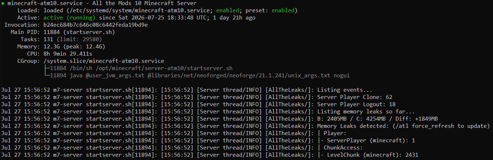

# Self-Hosted Minecraft Server

A self-hosted 24/7 modded Minecraft server deployed and administered on a dedicated mini PC running Ubuntu Server.

The project began as a way to replace a paid Minecraft hosting subscription with a self-managed solution for myself and my friends. I wiped the mini PC, installed Ubuntu Server, deployed the All the Mods 10 (ATM10) modpack, and configured the system to operate as a continuously running service.

The project developed into a practical Linux infrastructure and server administration project involving:

- Linux system administration
- Java and JVM configuration
- NeoForge server deployment
- SSH and SCP remote administration
- systemd service management
- Network configuration and port forwarding
- RCON remote console administration
- Resource monitoring and management
- Troubleshooting and technical problem-solving

## Key Highlights

- Migrated from third-party Minecraft hosting to self-hosted infrastructure
- Deployed a heavily modded Minecraft server on dedicated physical hardware
- Configured Java 21 and optimised JVM memory allocation
- Created a systemd service for automatic startup and restart handling
- Configured remote access through router port forwarding
- Diagnosed and resolved real-world network connectivity issues
- Implemented RCON for remote Minecraft administration
- Used Linux monitoring tools to investigate server resource usage
- Documented the deployment, networking, and server management processes

## Documentation

Detailed documentation is available in the `docs/` directory:

- [Deployment Guide](docs/deployment.md) - Server installation and deployment process
- [Networking and Troubleshooting](docs/networking.md) - Network configuration, port forwarding, and connectivity troubleshooting
- [Server Management](docs/server-management.md) - systemd, RCON, monitoring, backups, and ongoing administration

## Architecture



```text
                         Internet
                            │
                            │ TCP :25565
                            ▼
                    ┌─────────────────┐
                    │   TP-Link       │
                    │   Router        │
                    │                 │
                    │ Port Forwarding │
                    └────────┬────────┘
                             │
                             ▼
                    ┌─────────────────┐
                    │ Ubuntu Mini PC  │
                    │                 │
                    │    systemd      │
                    │       │         │
                    │       ▼         │
                    │  ATM10 Server   │
                    │       │         │
                    │    NeoForge     │
                    │       │         │
                    │     Java 21     │
                    └─────────────────┘

Administration:
Windows PC ──SSH──► Ubuntu Mini PC
                     │
                     └──RCON──► Minecraft Server
```

## Hardware

The server is hosted on a dedicated mini PC running continuously on my home network.

The mini PC is used as a headless server, allowing the Minecraft server to operate in the background without requiring a graphical desktop environment or an active SSH session.

This system provides sufficient system resources to run the heavily modded ATM10 server continuously alongside Ubuntu Server and its supporting services.

## Software Stack

| Component | Technology |
|---|---|
| Operating System | Ubuntu Linux |
| Minecraft Version | 1.21.1 |
| Modpack | All the Mods 10 (ATM10) |
| Mod Loader | NeoForge |
| Java | Java 21 |
| Server Management | systemd |
| Remote Administration | SSH |
| File Transfer | SCP |
| Remote Console | RCON / mcrcon |
| Network Access | TCP port forwarding |

## Memory Management

The server uses JVM arguments to control Minecraft's memory allocation.

The current JVM configuration allocates:

```text
-Xms8G
-Xmx12G
```

`-Xms8G` sets the initial Java heap size to 8 GB, while `-Xmx12G` allows the Java heap to expand up to a maximum of 12 GB when required.


The server's memory requirements were investigated using Linux system monitoring tools to ensure the mini PC had sufficient available RAM for the modded environment.

Linux memory usage can be checked using:

```bash
free -h
```

The JVM configuration can also be inspected to verify the memory allocation used by the running Java process.

## Server Management

The server is managed using a dedicated `systemd` service.

This allows the Minecraft server to:

- Run independently of an SSH session
- Start automatically when Ubuntu boots
- Be started and stopped using standard Linux service commands
- Restart automatically after unexpected failures
- Be monitored through the systemd journal

Common management commands include:

```bash
sudo systemctl start minecraft-atm10
sudo systemctl stop minecraft-atm10
sudo systemctl restart minecraft-atm10
sudo systemctl status minecraft-atm10
```

Live server logs can be viewed using:

```bash
sudo journalctl -u minecraft-atm10 -f
```

The service allows the server to continue running after an SSH session is closed, providing a reliable 24/7 server environment.

## Remote Administration

SSH is used to remotely administer the Ubuntu server.

This allows server management without physically accessing the mini PC.

SCP is used to transfer files from the Windows PC to the Ubuntu server, including server installation files and modpack server files.

RCON is also configured to allow Minecraft console commands to be executed remotely.

For example:

```bash
mcrcon -H 127.0.0.1 -P 25575 -p 'PASSWORD' "list"
```

RCON can be used for tasks such as:

- Checking connected players
- Sending server announcements
- Managing players
- Executing Minecraft commands
- Performing server administration without attaching directly to the Minecraft process

## Networking

The Minecraft server is hosted on a private home network while allowing authorised players outside the network to connect remotely.

The server uses the standard Minecraft TCP port:

```text
25565
```

Router port forwarding was configured to forward incoming Minecraft traffic from the public internet to the mini PC hosting the server.

The mini PC was also assigned a reserved private IP address through the router. This ensures that the port forwarding rule continues to target the correct device if the router is restarted or the network reconnects.

The server's `server-ip` setting is left blank, allowing Minecraft to listen on the available network interfaces rather than being restricted to a specific local address.

The network configuration was tested by connecting from both the local network and an external network.

## Troubleshooting

Several issues were encountered, but quickly resolved during development.

### Connectivity Troubleshooting

When external players initially encountered `getsockopt` connection errors, the issue was investigated at multiple layers.

The Minecraft server was first checked to confirm that it was actively listening on the expected port:

```bash
sudo ss -tulpn | grep 25565
```

The Ubuntu firewall was then checked:

```bash
sudo ufw status
```

The server was confirmed to be listening on all network interfaces, while the Ubuntu firewall was inactive.

The issue was ultimately resolved by configuring port forwarding on the TP-Link router to direct incoming Minecraft traffic to the mini PC.

This demonstrated the importance of troubleshooting connectivity across the full network path rather than assuming the problem was caused by the Minecraft server itself.

### Linux File Permissions

Server configuration files initially presented permission issues when attempting to modify them.

This required understanding Linux file ownership and permissions and ensuring that server files were owned by the dedicated `minecraft` user.

### RCON Configuration

RCON was configured to allow Minecraft console management without directly attaching to the Minecraft server process.

The `mcrcon` utility was installed and used to verify connectivity and execute Minecraft commands.

### Server Memory Allocation

The server's JVM configuration was inspected to determine its maximum heap allocation.

Linux memory usage was also checked using:

```bash
free -h
```

This helped confirm that the mini PC had sufficient available RAM for the heavily modded server.

### Mod Compatibility

A somewhat unrelated but noteworthy issue occurred when a friend attempted to connect to the server and encountered a client/server mod version mismatch.

The issue was traced to a mismatch in the installed version of CodeChicken Lib. The client was using an incompatible version of the dependency, preventing the connection from being established.

The issue was resolved by correcting the client's installed mod version so that it matched the version required by the server.

### Server Hosting Migration

The project also involved migrating from a third-party Minecraft hosting provider to a self-hosted solution.

The existing server was backed up before the migration. The Ubuntu mini PC was then prepared as a fresh server environment, and the ATM10 server files were transferred and configured on the system.

This required transferring files using SCP, configuring the new server environment, allocating appropriate system resources, and testing connectivity before moving to the self-hosted setup.

## Security Considerations

Sensitive information is intentionally excluded from this repository.

This includes:

- RCON passwords
- SSH credentials
- Private SSH keys
- Router login credentials
- Public IP addresses
- Other authentication secrets

Configuration examples use placeholder values instead of real credentials.

The RCON port is not exposed directly to the public internet. RCON administration is performed locally on the server through SSH, reducing the external attack surface.

## Future Improvements

Potential future uses for the mini PC include:

- Hosting additional self-hosted services
- Learning Docker and containerisation
- Hosting personal cloud storage
- Experimenting with virtualisation
- Running additional game servers
- Exploring self-hosted AI and machine learning applications

## Project Outcome

The project successfully replaced a paid Minecraft hosting service with a self-managed 24/7 server.

## Credits

This project uses the [All the Mods 10 (ATM10)](https://www.curseforge.com/minecraft/modpacks/all-the-mods-10) modpack developed by the ATMTeam.

The ATM10 modpack and its associated content are not included in this repository. The server was installed using the official server files provided through CurseForge.

The final setup allows myself and my friends to connect remotely while the server operates independently in the background.

The project also provided practical experience in Linux administration, networking, remote management, system services, and troubleshooting, while serving as a foundation for further self-hosting and server administration projects.
